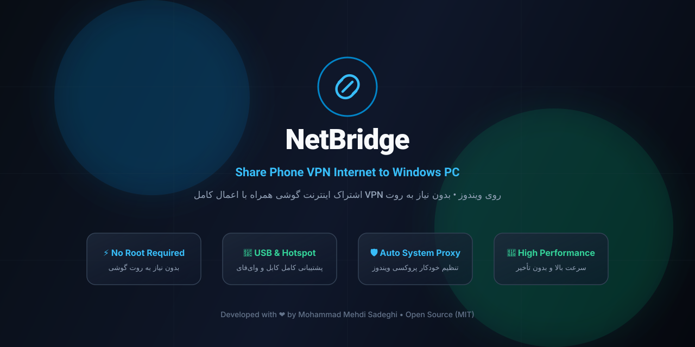

<p align="center">
  
</p>

<p align="center">
  <a href="https://github.com/MohammadMehdiSadeghi/NetBridge/releases"></a>
  <a href="LICENSE"></a>
  <a href="https://github.com/MohammadMehdiSadeghi/NetBridge/stargazers"></a>
  <a href="https://github.com/MohammadMehdiSadeghi/NetBridge/issues"></a>
</p>

<p align="center">
  <strong>NetBridge</strong> seamlessly shares your Android phone's internet connection with your Windows PC — <strong>with the phone's active VPN tunnel fully applied</strong> to all desktop traffic. No root required, zero configuration headaches, and automated Windows system proxy management.
</p>

---

## 🌐 Table of Contents / فهرست مطالب
- [English Documentation](#-english-documentation)
  - [Overview](#overview)
  - [How It Works](#how-it-works)
  - [Key Features](#key-features)
  - [Quick Start](#quick-start)
  - [Troubleshooting & VPN Settings](#troubleshooting--vpn-settings)
  - [Architecture & Ports](#architecture--ports)
  - [Building from Source](#building-from-source)
- [راهنمای فارسی](#-راهنمای-فارسی-persian-documentation)
  - [معرفی پروژه](#معرفی-پروژه)
  - [نحوه کارکرد](#نحوه-کارکرد)
  - [قابلیت‌های کلیدی](#قابلیت‌های-کلیدی)
  - [راهنمای نصب و راه‌اندازی سریع](#راهنمای-نصب-و-راه‌اندازی-سریع)
  - [رفع مشکل قطعی فیلترشکن (Bypass LAN)](#رفع-مشکل-قطعی-فیلترشکن-bypass-lan)
  - [پورت‌ها و ساختار پروژه](#پورت‌ها-و-ساختار-پروژه)
- [Author & License](#-author--license)

---

# 🇬🇧 English Documentation

## Overview

When you share your phone’s mobile connection via Wi-Fi Hotspot or USB Tethering, Android by default **bypasses any active VPN app** (such as v2rayNG, Clash, Shadowsocks, Psiphon, Outline) for all connected client devices. This means your PC receives raw, unfiltered ISP internet rather than the protected VPN tunnel.

**NetBridge** bridges this gap. It runs a lightweight, high-performance proxy server on your Android phone and automatically routes PC requests through the phone's active VPN tunnel.

```
[Windows PC] ──(HTTP/HTTPS Proxy)──> [NetBridge Mobile (:8080)] ──(Local Egress)──> [Phone Active VPN] ──> [Internet]
```

## Key Features

- ⚡ **Zero Root Required**: Works completely in user space without requiring root or modifying system partitions.
- 🛡️ **Full VPN Tunneling**: All Windows HTTP, HTTPS, and TLS traffic is routed directly through your phone's VPN.
- 🔌 **Dual Connection Support**: Fully supports both **Wi-Fi Hotspot** (default IP `192.168.43.1`) and **USB Tethering** (default IP `192.168.42.129`).
- 🔄 **Auto System Proxy**: The desktop app applies and restores Windows System Proxy settings cleanly with zero admin privilege required.
- 🔒 **Secure Pairing**: One-time 6-digit pairing code prevents unauthorized devices on your network from using your proxy.
- 📊 **Real-time Metrics**: Live upload/download bandwidth monitoring and active client tracking.
- 🌍 **Dual Language (English & Persian)**: Native RTL/LTR support with complete bilingual UI.

---

## Quick Start

### 1. Mobile App (Android)
- Download the pre-built `NetBridge-Android.apk` from the [Releases](https://github.com/MohammadMehdiSadeghi/NetBridge/releases) or directly from this repository root:
  ```
  https://github.com/MohammadMehdiSadeghi/NetBridge/raw/main/NetBridge.apk
  ```
- Install and launch the app on your Android device (Android 8.0+).

### 2. Desktop App (Windows)
- Download `NetBridge-Windows.exe` from the [Releases](https://github.com/MohammadMehdiSadeghi/NetBridge/releases).
- Run the executable on Windows 10/11 (no installer required).

### 3. Establish Connection
1. **Turn on your Phone's VPN** (e.g. v2rayNG, Clash, Psiphon).
2. Ensure **Bypass LAN** is enabled in your VPN app settings (see [Troubleshooting](#troubleshooting--vpn-settings) below).
3. Connect your PC via **Wi-Fi Hotspot** or plug in USB cable and enable **USB Tethering**.
4. In the **NetBridge Mobile App**, tap **Start Sharing** (شروع اشتراک).
5. In the **NetBridge Desktop App**, click **Scan for phone** (or enter IP manually: `192.168.43.1` for Hotspot, `192.168.42.129` for USB).
6. Enter the 6-digit pairing code shown on your phone screen and click **Connect**.
7. All Windows browser traffic is now flowing through your phone's VPN!

---

## Troubleshooting & VPN Settings

### ⚠️ Essential VPN Configuration (Bypass LAN)
If NetBridge connects initially but disconnects or drops when you turn on your VPN:
- **Root Cause**: Many VPN apps capture all IP traffic (`0.0.0.0/0`) by default. When the phone tries to return local response packets to your PC (`192.168.43.x`), the VPN routes them to the remote server, which drops them.
- **Solution**:
  - **v2rayNG / MahsaNG**: Open **Settings** (⚙️) ➡️ **Routing Mode** ➡️ set to **Bypass LAN** (دور زدن شبکه محلی).
  - **Clash / Sing-box / Nekobox**: Set Mode to **Rule** or enable **Bypass LAN**.
  - **Psiphon / Shadowsocks**: Enable **Exclude local network** / **Bypass LAN**.
  - Ensure the VPN app is in **All-apps mode** so NetBridge's outgoing traffic is tunneled.

### Common Issues
| Issue | Cause | Solution |
|---|---|---|
| **Phone Unreachable** | Hotspot/USB tethering is off | Turn on Hotspot or USB tethering on your phone. |
| **No Internet in Windows** | Metered connection enabled | In Windows Network Settings, toggle off **Metered connection** for that adapter. |
| **Pairing Failed / Timeout** | Firewall or wrong IP | Check your selected phone IP or manually enter `192.168.43.1` (Hotspot) or `192.168.42.129` (USB). |

---

## Architecture & Ports

| Port | Protocol | Purpose |
|---|---|---|
| `8080` | HTTP/HTTPS | Phone HTTP Proxy Server (handles CONNECT & HTTP requests) |
| `1080` | SOCKS5 | Phone SOCKS5 Proxy Server |
| `7777` | HTTP REST | Mobile Control API (Pairing, status, stats) |
| `18080` | HTTP | Local Desktop Proxy (Windows System Proxy endpoint) |

---

## Building from Source

### Prerequisites
- Node.js 20+ & npm
- Android Studio / JDK 17+ (for mobile app)

### Desktop App
```bash
git clone https://github.com/MohammadMehdiSadeghi/NetBridge.git
cd NetBridge/desktop
npm install
npm run dev      # Run in development mode
npm run build    # Build production bundle
npm run dist     # Package Windows executable
```

### Mobile App
```bash
cd NetBridge/mobile
./gradlew assembleDebug    # Build debug APK
./gradlew assembleRelease  # Build release APK
```

---

# 🇮🇷 راهنمای فارسی (Persian Documentation)

## معرفی پروژه

به طور پیش‌فرض در اندروید، هنگامی که اینترنت گوشی خود را از طریق **هات‌اسپات (Hotspot)** یا **کابل USB (Tethering)** با کامپیوتر به اشتراک می‌گذارید، ترافیک دستگاه‌های متصل **از فیلترشکن گوشی عبور نمی‌کند** و مستقیماً از اینترنت فیلترشده سیم‌کارت رد می‌شود.

پروژه **NetBridge** این مشکل را به طور کامل و بدون نیاز به روت حل می‌کند. با اجرای یک پروکسی سبک و فوق‌سریع روی گوشی و مدیریت هوشمند پروکسی سیستم در ویندوز، تمام ترافیک ویندوز مستقیماً از داخل تونل فیلترشکن گوشی عبور داده می‌شود.

```
مرورگر و برنامه‌های ویندوز ──> پروکسی محلی دسکتاپ ──> پروکسی گوشی (:8080) ──> فیلترشکن فعال گوشی ──> اینترنت آزاد
```

---

## قابلیت‌های کلیدی

- ⚡ **بدون نیاز به روت (No Root)**: کاملاً امن در سطح کاربری اجرا شده و به هیچ تغییری در سیستم‌عامل نیاز ندارد.
- 🛡️ **اعمال کامل فیلترشکن روی ویندوز**: باز شدن تمامی سایت‌های تحریم و فیلترشده (یوتیوب، اینستاگرام، تلگرام و...) روی کامپیوتر.
- 🔌 **پشتیبانی از هات‌اسپات و کابل USB**: سازگاری کامل با شبکه وای‌فای هات‌اسپات (`192.168.43.1`) و کابل USB (`192.168.42.129`).
- 🔄 **تنظیم خودکار System Proxy**: اتصال و قطع خودکار تنظیمات پروکسی ویندوز بدون نیاز به دسترسی Administrator.
- 🔒 **جفت‌سازی امن با کد ۶ رقمی**: جلوگیری از دسترسی افراد غیرمجاز حاضر در شبکه هات‌اسپات.
- 📊 **نمایش لحظه‌ای ترافیک**: محاسبه دقیق حجم مصرفی آپلود و دانلود و لیست دستگاه‌های متصل.
- 🌍 **پشتیبانی دوزبانه**: رابط کاربری کامل فارسی (راست‌به‌چپ) و انگلیسی.

---

## راهنمای نصب و راه‌اندازی سریع

### ۱. اپلیکیشن گوشی (اندروید)
- فایل نصبی `NetBridge-Android.apk` را از بخش [Releases](https://github.com/MohammadMehdiSadeghi/NetBridge/releases) یا مستقیماً از ریشه همین ریپازیتوری دانلود و نصب کنید:
  ```
  https://github.com/MohammadMehdiSadeghi/NetBridge/raw/main/NetBridge.apk
  ```

### ۲. نرم‌افزار کامپیوتر (ویندوز)
- فایل `NetBridge-Windows.exe` را دانلود کرده و روی ویندوز ۱۰ یا ۱۱ اجرا کنید (نیازی به نصب ندارد).

### ۳. مراحل اتصال
1. **فیلترشکن گوشی را روشن کنید** (v2rayNG، Clash، MahsaNG و...).
2. از فعال بودن گزینه **دور زدن شبکه محلی (Bypass LAN)** در فیلترشکن مطمئن شوید (توضیحات در ادامه).
3. هات‌اسپات گوشی را روشن کرده یا کابل USB را متصل کرده و در تنظیمات گوشی گزینه **اشتراک اینترنت USB (USB Tethering)** را فعال کنید.
4. در اپلیکیشن گوشی، دکمه **«شروع اشتراک»** را لمس کنید.
5. در نرم‌افزار ویندوز، دکمه **«جستجوی گوشی»** را بزنید (یا IP را دستی وارد کنید: `192.168.43.1` برای هات‌اسپات، `192.168.42.129` برای USB).
6. کد ۶ رقمی نمایش داده شده در گوشی را در دسکتاپ وارد کرده و **«اتصال»** را بزنید.
7. تمام! اکنون تمامی مرورگرها و برنامه‌های سیستم شما با فیلترشکن گوشی کار می‌کنند.

---

## رفع مشکل قطعی فیلترشکن (Bypass LAN)

### ⚠️ تنظیم بسیار مهم در فیلترشکن گوشی:
اگر دسکتاپ وصل می‌شود ولی با روشن کردن فیلترشکن اینترنت قطع می‌شود:
- **علت**: فیلترشکن‌ها به طور پیش‌فرض تمام ترافیک (`0.0.0.0/0`) را تصاحب می‌کنند؛ وقتی گوشی می‌خواهد بسته‌های پاسخ را به لپ‌تاپ (`192.168.43.x`) برگرداند، به اشتباه به سرور خارجی فیلترشکن می‌فرستد و ارتباط دسکتاپ قطع می‌شود.
- **راه‌حل فوری**:
  - **در v2rayNG / MahsaNG**: وارد **تنظیمات (Settings)** شوید ⬅️ گزینه **حالت روتینگ (Routing Mode)** را روی **دور زدن شبکه محلی (Bypass LAN)** قرار دهید.
  - **در Clash / Sing-box / Nekobox**: حالت مسیر‌یابی را روی **Rule** یا **Bypass LAN** بگذارید.
  - **در سایر فیلترشکن‌ها**: گزینه **Bypass local network / Exclude LAN** را فعال کنید.
  - مطمئن شوید فیلترشکن روی حالت **همه برنامه‌ها (All Apps)** تنظیم شده باشد.

---

## پورت‌ها و ساختار پروژه

| پورت | نوع پروتکل | کاربرد |
|---|---|---|
| `8080` | HTTP/HTTPS | سرور پروکسی HTTP گوشی (پشتیبانی از متد CONNECT و رمزنگاری TLS) |
| `1080` | SOCKS5 | سرور پروکسی SOCKS5 گوشی |
| `7777` | HTTP REST | وب‌سرویس مدیریت و جفت‌سازی امن گوشی |
| `18080` | HTTP | پروکسی محلی ویندوز (System Proxy Endpoint) |

---

## 👨‍💻 Author & License

Developed with ❤️ by **[Mohammad Mehdi Sadeghi](https://github.com/MohammadMehdiSadeghi)**

- 🌐 GitHub: [@MohammadMehdiSadeghi](https://github.com/MohammadMehdiSadeghi)
- 💼 LinkedIn: [mohammad-mehdi-sadeghi](https://www.linkedin.com/in/mohammad-mehdi-sadeghi)

This project is licensed under the **MIT License** — see the [LICENSE](LICENSE) file for details.
